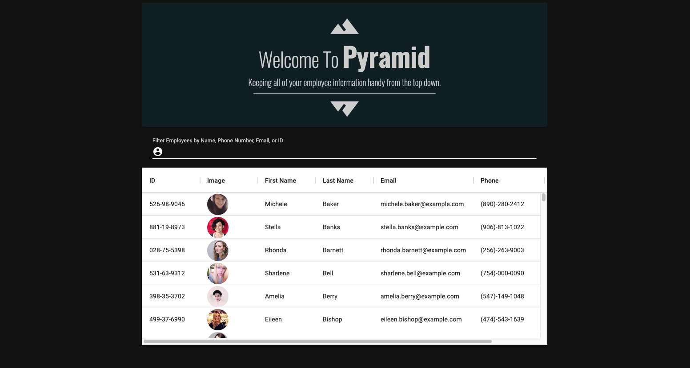

# Pyramid Employee Directory

An employee directory built with React that allows the user to have quick access to their employee's information. The user is able to filter the employees by name, email, phone number, etc. The Random User API was utilized to populate the table with dummy users.

   

View the deployed application <a href = "#!">here</a>

## Table of Contents

- [Installation](#installation)
- [Usage](#usage)
- [Resources](#resources)
- [Contributions](#contributions)
- [Testing](#testing)
- [Questions](#questions)
- [License](#license)

## Installation

If you would like to use the application in your local environment:

1. Clone the repo
2. Install required dependencies by running command `npm i`
3. Run command `npm start`

Otherwise, visit the deployed application <a href = "#!">here</a>

## Usage

#### Users are sorted in alphabetical order by default

#### Filtered by Name

#### Filtered by Email

#### Filtered by Phone Number

## Resources

**React**  
**Random User API**  
**Material UI**  
**Axios**  
**React Moment/Moment**  
**Google Fonts**

## Contributions

All contributions to this project are welcome! Clone down the repo to your local machine, commit changes, push to GitHub, and open a pull request!

## Testing

No tests are set up for Pyramid at this time. Feel free to write tests or search the application for bugs.

## Questions

If you have any further questions, feel free to reach out to me!  
<a href='https://www.github.com/twkirkpatrick'>Github</a>  
<a href='mailto:twk4491@gmail.com'>twk4491@gmail.com</a>

## License

Usage is provided under the MIT license.
